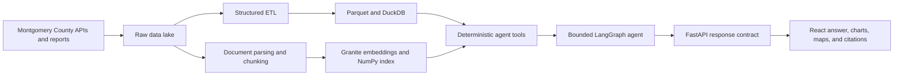
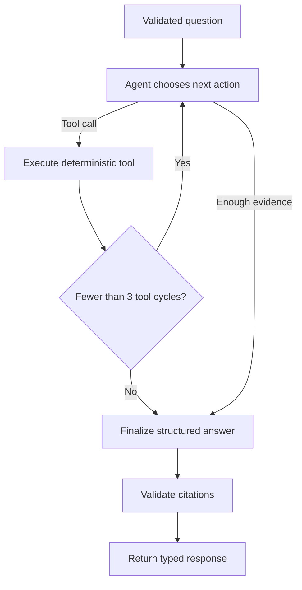

# MoCoLens: Project and AI Engineering Overview

**By Hein Htet**

## What MoCoLens is

MoCoLens is a public-facing, agentic analytics application for Montgomery County, Maryland. It allows a resident to ask a traffic-safety question in ordinary language and receive an answer grounded in county crash data and public Vision Zero reports.

The project started with a practical question: how can public data be made useful to someone who does not write SQL, understand government data schemas, or have time to read long planning documents? MoCoLens turns those separate sources into a single workflow that can answer questions such as:

- How have pedestrian crashes changed over time?
- Which roads or intersections have the most reported crashes?
- Are cyclists or pedestrians more affected by severe crashes?
- What does Montgomery County say it is doing about dangerous roads?
- What does the quantitative data show, and how does that compare with the county's stated policies?

MoCoLens is intentionally not a general chatbot. Its first domain is Montgomery County traffic safety and Vision Zero. The goal is to build one trustworthy vertical slice—from source ingestion through a public web interface—before expanding to housing, budgets, climate, MC311, or other county topics.

The current implementation consists of:

- a React frontend hosted on Vercel;
- a Python/FastAPI backend running in a Docker container on Render;
- curated crash data stored as Parquet and queried with DuckDB;
- public reports parsed into cited chunks and searched through semantic embeddings;
- a bounded LangGraph agent using Azure OpenAI;
- deterministic tools for SQL, document retrieval, calculations, source metadata, and visualizations.

Live application: <https://mocolens.vercel.app>

Repository: <https://github.com/Heinlh/mocolens>

## How the system works

The data pipeline first preserves source material in a raw data lake. Structured Socrata records are normalized into curated crash and participant tables. Reports are parsed with their headings, tables, page locations, titles, dates, and source URLs intact. This separation matters: SQL is the right retrieval method for counts and trends, while semantic search is the right retrieval method for policies and narrative reports.

At query time, the API validates the user's input and starts a new agent run. The agent decides whether the question needs structured crash data, report passages, or both. Tool results are added to the run's message state, calculations are performed by deterministic functions, and visualization specifications are built only from retrieved data. The final answer is returned in a typed schema that the frontend can render as narrative text, citations, KPI values, line charts, bar charts, maps, or tables.

## Technology stack

### Frontend

| Technology | How I used it |
|---|---|
| React 19 | Component-based public interface for Ask, Explore, Sources, Hotspots, and Saved Insights |
| TypeScript 6 | Shared, explicit contracts for API responses, metrics, citations, and visualization specifications |
| Vite 8 | Development server and optimized production build |
| React Router | Reload-safe routes for questions and individual saved insights |
| Tailwind CSS 4 | Responsive layout, visual system, and accessible interaction states |
| Recharts | Data-driven line and bar visualizations |
| Lucide React | Consistent interface icons |
| Browser `localStorage` | Stores the user's real saved answers and their visualization payloads in the current browser |
| Vercel | Frontend hosting and a small runtime configuration function for resolving the backend URL |

### Backend and AI orchestration

| Technology | How I used it |
|---|---|
| Python 3.12 | Primary backend, ingestion, processing, retrieval, and agent language |
| FastAPI and Uvicorn | Typed HTTP API and production application server |
| Pydantic | Structured output contracts between the model, API, and frontend |
| LangGraph | Explicit state machine for planning, tool execution, finalization, and validation |
| LangChain | Typed tool wrappers and Azure OpenAI integration |
| Azure OpenAI `gpt-4.1-mini` | Runtime reasoning, tool selection, and evidence synthesis |
| SlowAPI | Per-client query and dashboard rate limiting |
| Docker and Render | Reproducible backend deployment |

### Data, retrieval, and document processing

| Technology | How I used it |
|---|---|
| Montgomery County Socrata APIs | Crash, driver, and non-motorist source records |
| `httpx` and Beautiful Soup | API ingestion, report discovery, and downloads |
| YAML | Auditable source registry and refresh configuration |
| Docling | Layout-aware PDF parsing, table preservation, and structure-aware chunking |
| Parquet | Compact curated analytical artifacts |
| DuckDB | Local analytical SQL over curated crash data |
| IBM Granite Embedding 30M English | Semantic representation of report chunks and user searches |
| ONNX Runtime and Hugging Face Tokenizers | Memory-efficient production query encoding |
| NumPy | Flat cosine-similarity search over the report embedding matrix |

The first architecture draft used Chroma and a heavier PyTorch-based embedding runtime. Production measurements showed that those choices consumed too much memory for a 512 MB Render instance. I replaced them with an exported ONNX Granite model and a compressed NumPy index. The report corpus is only a few hundred chunks, so a direct matrix dot product is simpler, faster to start, and more memory-efficient than operating a full vector database at this scale. This was an engineering decision based on measured constraints, not a change in the product's retrieval behavior.

### Testing and quality tooling

- `pytest` for ingestion, transformation, retrieval-tool, agent-graph, and API behavior;
- a fake chat model for testing LangGraph decisions without paid model calls;
- FastAPI `TestClient` for validation, response, failure, and rate-limit behavior;
- deterministic SQL sandbox and visualization tests;
- TypeScript compilation and Vite production builds;
- Oxlint for frontend static analysis;
- Node-based storage and server-rendered route regression tests for Saved Insights;
- deployment-log review and direct production endpoint checks after releases.

## How I used AI

I used AI in two distinct ways: as a supervised implementation partner while building the project, and as a constrained reasoning component inside the product. Keeping those roles separate helped me avoid treating AI output as automatically correct.

### AI-assisted development under supervision

I used AI coding assistants to accelerate repository exploration, implementation, debugging, test writing, and deployment diagnosis. I remained responsible for the architecture, scope, acceptance criteria, and final review.

My supervision process included:

1. Writing an explicit architecture document before implementation.
2. Defining the product as a narrow public-data analyst rather than a general assistant.
3. Requiring evidence, provenance, deterministic calculations, and bounded behavior.
4. Reviewing generated code against the architecture and the actual upstream data schema.
5. Providing deployment logs and screenshots when live behavior differed from local behavior.
6. Requiring a reproduce–patch–test–review loop instead of accepting the first plausible change.
7. Verifying production assets and endpoints after pushing changes.

This supervision caught issues that a code-only review would not have found. Examples include a production frontend silently returning one fixed mock answer, every prompt losing its identity at the result route, dynamic visualization payloads being ignored by the UI, a Saved Insights link pointing directly to a bundled Silver Spring example, and a deployment that used too much memory before binding its port.

### AI inside the application

The runtime model is not allowed to act as an unrestricted autonomous agent. I use it as a planner and synthesizer inside a deterministic harness.

The model can choose from a narrow toolset:

- `query_analytics` for structured crash counts, trends, comparisons, and locations;
- `search_reports` for Vision Zero plans and public report passages;
- `get_source_metadata` for provenance and freshness;
- deterministic statistics tools for percentage change, rates, averages, medians, rankings, and year-over-year comparisons;
- `build_visualization_spec` for a chart, map, KPI, or table derived from verified query rows.

The model does not receive unrestricted filesystem access, shell access, arbitrary network access, or direct database access. Even when it writes SQL, the SQL executes inside a separate locked-down analytical sandbox.

## Context engineering

I treat context as an engineered input, not as a large collection of text placed in a prompt.

The runtime context has several layers:

1. **Role and domain context.** The system prompt defines MoCoLens as an evidence-grounded Montgomery County traffic-safety analyst, not a general chatbot.
2. **Routing context.** The prompt explains which evidence source is appropriate: SQL for structured crash questions, semantic report search for policy questions, and both for hybrid questions.
3. **Tool context.** Each tool has a narrow typed description, expected inputs, allowed tables, and a specific responsibility.
4. **Evidence context.** Tool outputs are appended to the LangGraph message state, so final synthesis sees the exact evidence retrieved during that run.
5. **Answer context.** A separate finalization instruction defines plain-language requirements, caveats, citation behavior, and standalone follow-up questions.
6. **UI context.** The API returns a structured `QueryResponse`, allowing the frontend to render the answer according to its actual visualization payload instead of guessing from prose.

Context is scoped to one query run. The application does not currently pass uncontrolled conversation history between users or sessions. Follow-up prompts are therefore required to be complete, standalone traffic-safety questions. This reduces accidental context contamination and keeps each answer independently auditable.

I also encoded important analytical boundaries directly into context. For example, the model may not call the road with the fewest crashes the "safest" road when no traffic-volume denominator is available. It must provide the closest supported comparison and place the limitation next to the result. Likewise, it must not turn a correlation in crash records into a causal claim unless a retrieved report explicitly supports that interpretation.

## Harness engineering

The harness is the deterministic software surrounding the probabilistic model. Its purpose is to make useful model behavior easier and unsafe or unverifiable behavior harder.

Key parts of the harness include:

### Typed model and API contracts

The model's final output must validate against a Pydantic `AgentAnswer` schema. The API then maps it into a frontend-aligned `QueryResponse`. Required fields include the direct answer, summary, explanation, caveats, citations, county report points, and follow-up prompts. This prevents the UI from depending on unpredictable free-form formatting.

### SQL defense in depth

The model's SQL never runs against the real DuckDB database file. The query tool:

- creates an in-memory database containing only approved Parquet tables;
- disables external file access after loading those tables;
- parses SQL with DuckDB's parser;
- allows exactly one `SELECT` statement;
- blocks sensitive commands such as `ATTACH`, `COPY`, `PRAGMA`, and `LOAD`;
- applies a hard row limit;
- interrupts queries that exceed the time limit;
- records an audit entry for every attempted query.

No single check is treated as sufficient. The layers are designed so that another boundary remains if one check has a gap.

### Citation validation

Citation validation is deterministic Python, not another model judgment. After final synthesis, the validator compares every claimed citation with sources actually returned by report or metadata tools during that run. Unsupported citations are removed. If no source tool ran, report citations cannot appear in the final answer.

### Input and cost controls

The API rejects empty, extremely short, overlong, repeated, link-based, obvious prompt-injection, and clearly off-topic input before starting a paid model request. The topical filter is intentionally tuned to over-accept legitimate traffic-safety phrasing; the system prompt remains the second domain boundary.

Anonymous usage is limited by client IP to 10 natural-language queries per minute and 40 per hour. Dashboard requests have a higher limit because they run inexpensive local analytics. These controls allow a visitor to explore the product while limiting accidental refresh loops and obvious abuse.

### Deterministic visualization handling

The model selects an appropriate visualization type, but it cannot invent the chart's values. Visualization specifications must be built from rows returned by the structured query tool. A deterministic backend fallback selects a line chart for time series, a bar chart for category comparisons, a map for coordinates, a KPI for one value, or a table for other useful rows if the model omits the visualization call.

### Test harness

The agent graph accepts an injectable model, so tests can use a fake LLM and inspect tool calls, state transitions, cycle counts, finalization context, and citation removal without sending paid requests. Retrieval tools are tested independently, and the API tests mock the agent when the test only concerns HTTP behavior. This isolates failures and makes the expensive probabilistic component replaceable.

## Loop engineering

The central runtime loop is explicit and bounded:

The maximum is three retrieval/tool cycles. The cycle check happens immediately after tool execution. That detail prevents a wasted model call in which the agent plans a fourth tool action that the application would then discard.

The prompt also gives the model a semantic stopping rule: once it has enough evidence to answer, it should stop calling tools. The hard graph limit handles the case where that instruction is not followed.

I used the same loop discipline during development:

1. reproduce the issue locally or against the deployed application;
2. identify the exact boundary that failed;
3. make the smallest coherent implementation change;
4. run targeted regression tests;
5. run the full available build and lint checks;
6. inspect the output rather than relying only on exit codes;
7. repeat the coding step when review reveals a misleading or incomplete behavior;
8. deploy and verify the public asset or endpoint.

For example, the first Saved Insights fix removed the hardcoded route. Reviewing that implementation showed that merely displaying an empty page was not a complete feature, so I added real browser-local saving, unique detail routes, deletion, deduplication, visualization preservation, and regression coverage. A second review found that sharing a browser-local URL would be misleading, so I removed that action before deployment.

## Important design choices

### One complete domain before many partial domains

Traffic safety is narrow enough to audit and rich enough to require both quantitative and document retrieval. The architecture remains domain-oriented so another county topic can later add sources, transformations, and tool configuration without replacing the core workflow.

### Deterministic systems around probabilistic reasoning

I use the LLM for interpreting intent, selecting tools, and explaining evidence. I use conventional code for arithmetic, SQL enforcement, rate limiting, schemas, citations, storage, and chart construction. This puts the model where flexibility is valuable and code where predictability is essential.

### Structured data and narrative documents stay separate

Putting millions of individual crash records into a vector database would make exact counts and groupings less reliable. DuckDB answers those questions directly. Semantic retrieval is reserved for the report language it is designed to search.

### A modular monolith instead of premature infrastructure

The MVP uses one backend application, local analytical artifacts, and a small frontend. It avoids microservices, Kubernetes, multiple model providers, a large GIS platform, and other infrastructure that would add operating cost before the public workflow is proven.

### Honest failure states

Production no longer replaces an unreachable backend with a polished but unrelated mock answer. Configuration, validation, rate-limit, and network errors are shown as errors. This is especially important for a public-data application, where a convincing fabricated answer is worse than a visible failure.

## How I intend to improve MoCoLens

### 1. Build a formal evaluation harness

The current project has deterministic unit and integration coverage, but it needs a repeatable model-quality evaluation suite. I plan to create a versioned set of structured, document, hybrid, ambiguous, adversarial, and out-of-domain questions. Each case should evaluate:

- correct tool selection;
- SQL correctness and result consistency;
- report retrieval relevance;
- citation precision and completeness;
- unsupported-claim rate;
- visualization appropriateness;
- caveat quality;
- latency and model cost;
- plain-language usefulness.

I also want release gates so prompt, model, retrieval, or data changes cannot silently regress core questions.

### 2. Expand and automate source coverage

The report crawler currently covers only the documents it can discover from the configured county pages. I plan to improve discovery for dynamically rendered pages, add scheduled refresh jobs, detect schema and document changes, rebuild only affected chunks, and publish source freshness in the interface.

### 3. Replace remaining mock-only screens

The main Ask and Dashboard flows use the backend, but the dedicated Hotspots and Sources screens still contain prototype data. I plan to add real API endpoints for those pages and remove the remaining frontend mocks.

### 4. Improve geographic and exposure-aware analysis

Crash counts alone do not measure risk. I plan to add traffic volume, pedestrian exposure, roadway mileage, and a reliable geographic crosswalk for communities and municipalities. This would support more defensible questions about relative risk and "safest" areas.

### 5. Add persistent accounts and saved insights

Saved Insights currently lives in browser storage. A future version should provide optional authentication, server-side saved answers, cross-device access, explicit deletion, and shareable snapshots that preserve the original evidence and data-as-of date.

### 6. Strengthen production controls

The current in-memory rate limiter is appropriate for one small Render process but is not global across multiple instances. At larger scale I plan to use a shared Redis-backed limiter, authenticated quotas, better abuse monitoring, and centralized structured logs and traces.

### 7. Improve latency and resilience

Planned work includes safe caching of repeated analytical results, streaming progress states, smaller deployment artifacts, better cold-start behavior, request timeouts, retry policies for upstream model errors, and clearer partial-answer behavior when one evidence source is temporarily unavailable.

### 8. Add carefully scoped conversation context

Today, every answer is independently auditable and follow-ups are rewritten as standalone questions. I plan to add opt-in conversation memory that carries only explicit entities, time ranges, filters, and cited evidence forward. I do not want to append unlimited chat history or allow old evidence to become an invisible source of truth.

### 9. Improve accessibility and mapping

I plan to add stronger keyboard and screen-reader testing, textual summaries for every visualization, reduced-motion support, contrast checks, responsive chart labels, and a real geographic map layer with accessible table alternatives.

### 10. Expand to another county domain only after evaluation

Once the Vision Zero workflow has stable evaluations and complete live screens, I intend to apply the same source-registry, ingestion, retrieval, and bounded-agent pattern to another Montgomery County domain. Expansion should happen through new domain connectors and schemas, not by weakening the existing system boundaries.

## Closing perspective

MoCoLens is less about placing a chat box on top of public data and more about engineering a trustworthy path between a question and its evidence. The model is one component of that path. The larger system—source preservation, retrieval separation, typed tools, bounded loops, deterministic validation, visible caveats, testing, and human supervision—is what makes the answer useful.

My central design principle is simple: use AI for interpretation and explanation, but require software boundaries and evidence to control what reaches the public.
