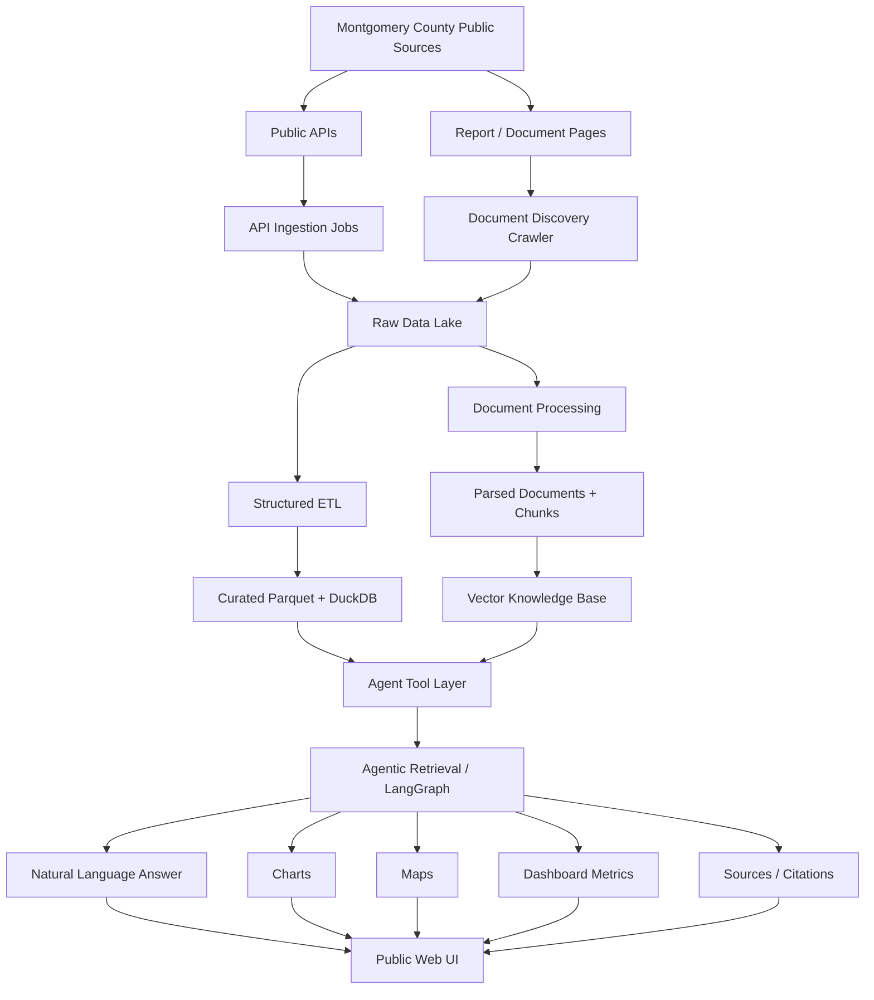
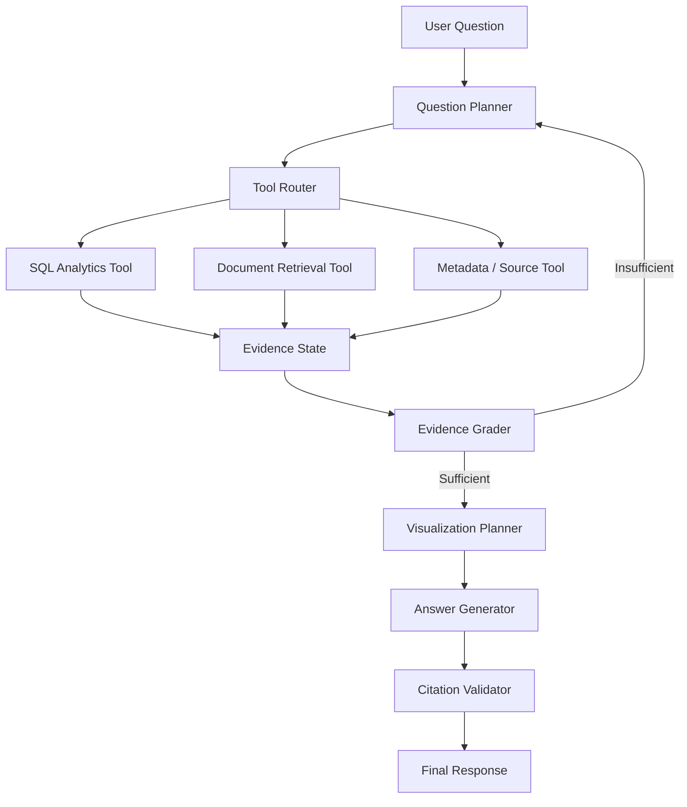

# MoCoLens MVP Architecture

## 1. Purpose

**MoCoLens** is a public-facing, agentic analytics system for Montgomery County, Maryland. Users ask questions in natural language and receive evidence-backed answers that combine:

1. Structured public data from county APIs.
2. Public county reports and policy documents.
3. Agentic retrieval across structured and unstructured sources.
4. Plain-language explanations, citations, charts, dashboards, and maps.

The MVP should prove the complete end-to-end workflow without trying to support every Montgomery County department on day one.

### MVP domain

Start with **traffic safety / Vision Zero** because it naturally requires both:

- structured crash and transportation data; and
- unstructured annual reports, action plans, work plans, and policy documents.

The architecture must be domain-extensible so housing, MC311, budget, climate, public safety, and other county domains can be added later as new connectors rather than requiring a redesign.

---

## 2. Product Goal

A member of the general public should be able to ask:

> "Have pedestrian crashes gotten worse in Silver Spring since 2022, where are the hotspots, and what is Montgomery County doing about them?"

MoCoLens should be able to:

1. Understand the question.
2. Break it into analytical subproblems.
3. Decide which tools and sources are required.
4. Query structured crash data.
5. Calculate trends and relevant statistics.
6. Retrieve relevant passages from county reports.
7. Evaluate whether the evidence is sufficient.
8. Retrieve again if necessary.
9. Generate charts/maps when they improve understanding.
10. Return a concise, plain-language answer with citations, methodology, and caveats.

The system is not a generic chatbot. It is an **evidence-grounded public data analyst**.

---

# 3. MVP Principles

Claude Code should follow these principles during implementation.

## 3.1 Keep the MVP narrow

Build one complete vertical slice before adding additional county domains.

Initial supported domain:

- Vision Zero / traffic safety
- crash data APIs
- Vision Zero reports

Do not add housing, budgets, MC311, climate, or crime until the first domain works end to end.

## 3.2 Structured data and documents are different retrieval problems

Do **not** place individual structured API records into the vector database.

Use:

- **DuckDB / SQL** for structured analytical data.
- **Vector retrieval** for reports and narrative documents.

The agent decides which one, or both, are required.

## 3.3 Preserve raw source data

Every downloaded document and API response must first be stored in the data lake before transformation.

Raw source files are immutable.

## 3.4 Answers must be grounded

Every factual claim should be traceable to:

- a structured data query,
- a public report passage,
- or both.

The UI should expose sources used for the response.

## 3.5 Optimize for public understanding

Default outputs should favor:

- plain English,
- short explanations,
- labeled charts,
- understandable percentages and counts,
- definitions for technical terms,
- explicit caveats.

Avoid jargon unless it is immediately explained.

---

# 4. High-Level Architecture



---

# 5. Recommended MVP Technology Stack

Prioritize local development, low cost, and replaceable components.

| Layer | MVP choice | Responsibility |
|---|---|---|
| Language | Python 3.12+ | Primary backend/data language |
| API ingestion | `httpx` | Fetch county APIs |
| Web crawling | `httpx` + BeautifulSoup | Discover public reports |
| PDF parsing | PyMuPDF | Extract report text |
| Data lake | Local filesystem | Raw, processed, curated artifacts |
| File format | Parquet | Analytical storage |
| Analytics DB | DuckDB | SQL and local OLAP |
| Embeddings | Sentence Transformers | Local document embeddings |
| Vector DB | Chroma | Local vector retrieval |
| Agent orchestration | LangGraph | Explicit agent workflow |
| Backend API | FastAPI | Query and metadata endpoints |
| Visualization | Plotly | Interactive charts/maps |
| MVP frontend | Streamlit | Fast public-facing analytics UI |
| Scheduling | GitHub Actions or local scheduled job | Periodic ingestion |
| Tests | pytest | Unit/integration tests |
| Config | YAML + environment variables | Source registry and secrets |

All external services should be behind interfaces so they can later be replaced with managed equivalents.

---

# 6. Data Lake Design

Use a simple medallion-style layout.

```text
data/
├── raw/
│   ├── api/
│   │   └── vision_zero/
│   │       └── YYYY-MM-DD/
│   │           ├── crash_incidents.json
│   │           ├── drivers.json
│   │           └── non_motorists.json
│   │
│   └── documents/
│       └── vision_zero/
│           ├── PDFs/
│           └── manifest.jsonl
│
├── processed/
│   ├── api/
│   │   └── vision_zero/
│   │       └── *.parquet
│   │
│   └── documents/
│       └── vision_zero/
│           ├── parsed/
│           └── chunks/
│
└── curated/
    └── vision_zero/
        ├── crashes.parquet
        ├── crash_participants.parquet
        ├── locations.parquet
        └── analytics.duckdb
```

## Raw layer

Contains exact downloaded source material.

Examples:

- original JSON API responses,
- PDFs,
- HTTP metadata,
- timestamps,
- source URLs.

Never mutate raw files.

## Processed layer

Contains normalized but not business-aggregated data.

Examples:

- standardized column names,
- parsed dates,
- cleaned coordinates,
- extracted PDF text,
- document chunks.

## Curated layer

Contains analytics-ready datasets.

Examples:

- joined crash tables,
- derived injury severity fields,
- geographic dimensions,
- year/month features,
- reusable aggregate tables.

---

# 7. Source Registry

Do not hard-code ingestion logic throughout the project.

Create a configuration file:

```text
config/
└── sources.yaml
```

Example:

```yaml
domains:
  vision_zero:
    api_sources:
      - id: crash_incidents
        type: socrata
        url: "<dataset-api-url>"
        refresh: weekly

      - id: crash_drivers
        type: socrata
        url: "<dataset-api-url>"
        refresh: weekly

      - id: crash_non_motorists
        type: socrata
        url: "<dataset-api-url>"
        refresh: weekly

    document_sources:
      - id: vision_zero_reports
        type: webpage
        url: "<vision-zero-report-index-page>"
        allowed_domains:
          - montgomerycountymd.gov
        allowed_extensions:
          - pdf
```

Each future county domain should primarily be added through configuration plus a domain-specific transformation module if required.

---

# 8. Automated Document Ingestion

## 8.1 Discovery workflow

The crawler starts from approved seed pages.

```text
Seed page
   ↓
Fetch HTML
   ↓
Extract links
   ↓
Normalize URLs
   ↓
Filter to approved domain/path/file types
   ↓
Identify documents
   ↓
Compare against manifest
   ↓
Download new/changed files
```

Do not crawl the entire Montgomery County website.

Only crawl:

- explicitly configured seed pages,
- approved domains,
- approved URL paths,
- approved file types.

## 8.2 Document manifest

Every discovered document must have a manifest record.

Suggested fields:

```json
{
  "document_id": "sha256-or-stable-id",
  "source_url": "...",
  "title": "...",
  "domain": "vision_zero",
  "department": "Montgomery County",
  "document_type": "annual_report",
  "publication_year": 2025,
  "downloaded_at": "...",
  "content_hash": "...",
  "http_etag": "...",
  "last_modified": "...",
  "local_path": "...",
  "status": "processed"
}
```

Use the manifest to support:

- deduplication,
- change detection,
- incremental updates,
- provenance,
- troubleshooting.

## 8.3 Change detection

Before reprocessing:

1. Compare URL.
2. Compare ETag / Last-Modified if available.
3. Compare SHA-256 content hash.
4. Skip unchanged files.
5. Reprocess changed files.

---

# 9. Document Processing Pipeline

```text
PDF
 ↓
Extract text
 ↓
Preserve page numbers
 ↓
Clean headers/footers
 ↓
Extract metadata
 ↓
Semantic chunking
 ↓
Create embeddings
 ↓
Store chunks in vector DB
```

## Chunk metadata

Every chunk must preserve provenance.

```json
{
  "chunk_id": "...",
  "document_id": "...",
  "title": "FY2025 Vision Zero Annual Report",
  "page_start": 14,
  "page_end": 15,
  "section": "Pedestrian Safety",
  "year": 2025,
  "domain": "vision_zero",
  "source_url": "...",
  "text": "..."
}
```

Recommended initial chunking:

- approximately 500-900 tokens,
- 10-15% overlap,
- prefer section-aware boundaries,
- never discard page references.

---

# 10. API Ingestion Pipeline

Structured APIs should be snapshotted into the raw data lake before transformation.

```text
County API
 ↓
Fetch paginated records
 ↓
Save raw JSON
 ↓
Validate schema
 ↓
Normalize fields
 ↓
Write Parquet
 ↓
Build curated tables
 ↓
Register in DuckDB
```

## Requirements

Each ingestion run should record:

- source,
- ingestion timestamp,
- record count,
- schema,
- pagination status,
- success/failure,
- source update timestamp if available.

## Idempotency

Running the same ingestion job twice should not create duplicate logical records.

Use stable source identifiers whenever available.

---

# 11. Analytical Data Model

Keep the first schema simple.

Possible Vision Zero model:

```text
fact_crashes
-------------
crash_id
crash_date
crash_time
latitude
longitude
road_name
municipality
severity
weather
light_condition
collision_type
pedestrian_involved
cyclist_involved
fatality_count
injury_count

dim_location
------------
location_id
municipality
community
road_name
latitude
longitude

dim_date
--------
date
year
quarter
month
day_of_week

fact_participants
-----------------
participant_id
crash_id
participant_type
age_group
injury_severity
```

Do not model every possible field before there is a user-facing need for it.

---

# 12. Vector Knowledge Base

The vector database stores **document chunks only**.

It should support:

- semantic retrieval,
- metadata filtering,
- source/date filtering,
- top-k retrieval.

Example retrieval:

```text
semantic query:
"county response to pedestrian crashes"

filters:
domain = vision_zero
year >= 2023
```

The vector store must return chunk text plus metadata required for citations.

---

# 13. Agent Architecture

Use LangGraph or an equivalent explicit state machine.

Do not build an unrestricted autonomous agent.

The MVP agent should have a small, auditable toolset.



---

# 14. Agent Tools

Keep each tool deterministic where possible.

## 14.1 `query_analytics`

Purpose:

Run approved analytical SQL against curated DuckDB tables.

Input:

```json
{
  "question": "...",
  "sql": "...",
  "reason": "..."
}
```

Output:

```json
{
  "columns": [],
  "rows": [],
  "row_count": 0,
  "query": "...",
  "data_as_of": "..."
}
```

Claude/LLM-generated SQL must be:

- read-only,
- limited to approved tables,
- validated before execution,
- subject to row/time limits.

## 14.2 `search_reports`

Purpose:

Semantic search over county documents.

Input:

```json
{
  "query": "...",
  "filters": {},
  "top_k": 5
}
```

Output:

- chunk text,
- document title,
- page,
- publication date/year,
- source URL,
- similarity score.

## 14.3 `get_source_metadata`

Purpose:

Return source freshness, dataset descriptions, report dates, and provenance.

## 14.4 `calculate_statistics`

Purpose:

Perform deterministic calculations such as:

- percentage change,
- rates,
- averages,
- medians,
- ranking,
- year-over-year comparison.

Do not rely on the language model to perform nontrivial arithmetic in prose.

## 14.5 `build_visualization_spec`

Purpose:

Convert verified query results into a structured visualization specification.

Allowed MVP visualization types:

- line chart,
- bar chart,
- map,
- KPI cards,
- compact table.

---

# 15. Agent State

Suggested LangGraph state:

```python
class AgentState(TypedDict):
    user_question: str
    interpreted_question: dict
    plan: list
    sql_results: list
    retrieved_chunks: list
    source_metadata: list
    calculations: list
    evidence_summary: str
    evidence_sufficient: bool
    visualization_specs: list
    final_answer: str
    citations: list
```

---

# 16. Retrieval Logic

The router should classify each sub-question.

## Structured-only example

> "How many pedestrian crashes occurred in 2025?"

Route:

```text
Question
 → SQL
 → statistics
 → answer
```

## Document-only example

> "What pedestrian safety strategies are included in the Vision Zero plan?"

Route:

```text
Question
 → vector retrieval
 → answer
```

## Hybrid example

> "Pedestrian crashes increased in Silver Spring. What is the county doing about it?"

Route:

```text
Question
 → SQL trend analysis
 → determine relevant geography/time
 → search reports
 → compare quantitative and narrative evidence
 → answer
```

Hybrid questions are the primary reason this system uses agentic RAG.

---

# 17. Evidence Grading

Before producing the final response, the agent should evaluate:

1. Did we answer every part of the question?
2. Are quantitative claims supported by query results?
3. Are policy/program claims supported by documents?
4. Are the documents relevant to the same geography/time period?
5. Are sources sufficiently recent?
6. Are important limitations present?
7. Is another retrieval step necessary?

If evidence is insufficient, the agent may perform another retrieval cycle.

Limit loops in the MVP to avoid runaway behavior.

Recommended maximum:

```text
3 retrieval/planning cycles
```

---

# 18. Natural-Language Answer Contract

Every answer should follow approximately this structure.

## Direct answer

1-3 sentences answering the user's question.

## What the data shows

Plain-language quantitative findings.

Example:

> Pedestrian crashes rose from X to Y between 2022 and 2025, an increase of Z%.

## Where / when

Important geographic or temporal patterns.

## What county reports say

Relevant programs, explanations, policies, or planned interventions.

## Visualization

Only include charts or maps that materially improve understanding.

## Caveats

Examples:

- incomplete reporting periods,
- correlation versus causation,
- small sample sizes,
- changing reporting definitions,
- geographic ambiguity.

## Sources

Show:

- dataset name,
- report title,
- page when applicable,
- source URL,
- data/report date.

---

# 19. Public-Facing Visualization Rules

The audience is not assumed to be technical.

## Charts

Prefer:

- line charts for trends,
- bar charts for comparisons,
- simple KPI cards,
- maps for geographic patterns.

Avoid:

- overly dense charts,
- unnecessary 3D graphics,
- technical statistical plots unless requested.

## Labels

Use human-readable labels.

Prefer:

```text
Pedestrian crashes
```

over:

```text
non_motorist_incident_count
```

## Tooltips

Explain metrics in plain language.

## Maps

For crash maps:

- aggregate when possible,
- avoid implying an individual location caused an incident,
- show the time range,
- distinguish counts from rates.

---

# 20. Dashboard MVP

The landing page should contain two modes.

## Mode 1: Ask MoCoLens

Natural-language input:

```text
Ask a question about Montgomery County traffic safety...
```

Response includes:

- plain-language answer,
- visualization,
- key metrics,
- citations,
- expandable "How this was calculated" section.

## Mode 2: Explore Dashboard

Initial dashboard:

### KPI cards

- crashes this year,
- pedestrian crashes,
- cyclist crashes,
- serious/fatal crashes.

### Trend chart

Crashes over time.

### Breakdown chart

Crashes by severity or road-user type.

### Map

Crash hotspots / geographic distribution.

### Filters

- date range,
- municipality/community,
- road-user type,
- severity.

The dashboard should use the same curated analytical layer as the agent.

Do not create a second analytics pipeline for the dashboard.

---

# 21. API Layer

FastAPI should expose a small public interface.

Suggested endpoints:

```text
POST /api/query
GET  /api/dashboard/summary
GET  /api/dashboard/trends
GET  /api/dashboard/map
GET  /api/sources
GET  /api/health
```

## `POST /api/query`

Request:

```json
{
  "question": "Have pedestrian crashes increased since 2022?"
}
```

Response:

```json
{
  "answer": "...",
  "metrics": [],
  "visualizations": [],
  "citations": [],
  "data_as_of": "...",
  "limitations": []
}
```

---

# 22. Suggested Repository Structure

```text
mocolens/
├── README.md
├── ARCHITECTURE.md
├── pyproject.toml
├── .env.example
│
├── config/
│   └── sources.yaml
│
├── data/
│   ├── raw/
│   ├── processed/
│   └── curated/
│
├── src/
│   └── mocolens/
│       ├── ingestion/
│       │   ├── api/
│       │   │   ├── base.py
│       │   │   └── socrata.py
│       │   ├── documents/
│       │   │   ├── crawler.py
│       │   │   ├── downloader.py
│       │   │   └── manifest.py
│       │   └── runner.py
│       │
│       ├── processing/
│       │   ├── pdf_parser.py
│       │   ├── chunker.py
│       │   └── transforms/
│       │
│       ├── storage/
│       │   ├── lake.py
│       │   ├── duckdb_store.py
│       │   └── vector_store.py
│       │
│       ├── retrieval/
│       │   ├── sql_tool.py
│       │   ├── report_tool.py
│       │   ├── statistics_tool.py
│       │   └── metadata_tool.py
│       │
│       ├── agent/
│       │   ├── state.py
│       │   ├── planner.py
│       │   ├── router.py
│       │   ├── grader.py
│       │   ├── graph.py
│       │   └── prompts.py
│       │
│       ├── visualization/
│       │   ├── charts.py
│       │   └── maps.py
│       │
│       └── api/
│           └── main.py
│
├── app/
│   └── streamlit_app.py
│
├── scripts/
│   ├── ingest.py
│   ├── rebuild_vector_index.py
│   └── build_curated_tables.py
│
└── tests/
    ├── ingestion/
    ├── processing/
    ├── retrieval/
    ├── agent/
    └── api/
```

---

# 23. Ingestion CLI

Claude Code should provide a simple CLI.

Examples:

```bash
python scripts/ingest.py --domain vision_zero
```

Optional:

```bash
python scripts/ingest.py --domain vision_zero --documents-only
python scripts/ingest.py --domain vision_zero --api-only
python scripts/ingest.py --domain vision_zero --force
```

Expected output:

```text
[vision_zero]
API sources checked: 3
API records downloaded: 12,431
Documents discovered: 28
New documents: 2
Changed documents: 1
Documents skipped: 25
Chunks embedded: 214
Curated tables refreshed: 4
Status: SUCCESS
```

---

# 24. Scheduled Refresh

Once manual execution is stable:

```text
Scheduled job
 ↓
Run ingestion
 ↓
Discover source changes
 ↓
Update raw lake
 ↓
Reprocess changed assets
 ↓
Refresh curated tables
 ↓
Update changed vector chunks
 ↓
Run smoke tests
```

Do not rebuild the entire vector database if only one document changed.

---

# 25. Observability

Every pipeline run should write structured logs.

Track:

- source,
- start/end timestamp,
- files discovered,
- files downloaded,
- rows downloaded,
- rows rejected,
- schema changes,
- chunks created,
- errors,
- duration.

Keep:

```text
logs/
└── ingestion/
```

For MVP, local JSONL logs are sufficient.

---

# 26. Data Quality Checks

Add deterministic checks before data becomes queryable.

Examples:

```text
crash_id is not null
crash_date is parseable
latitude is within expected geographic bounds
longitude is within expected geographic bounds
severity belongs to known values
duplicate source IDs are flagged
record counts do not unexpectedly collapse
```

If an upstream schema changes, fail clearly rather than silently producing incorrect analytics.

---

# 27. Safety and Analytical Integrity

This is a public analytics system, so the application must distinguish:

```text
Observation
Correlation
Interpretation
Causation
```

The system must not state causal conclusions unless a cited source establishes them.

Bad:

> "Road design caused the crash increase."

Better:

> "Crashes increased during this period. County reports identify road design as one of several safety concerns, but the available data alone does not establish causation."

Also:

- expose source freshness,
- state partial-year data,
- avoid false precision,
- explain denominator choices,
- distinguish absolute counts from rates,
- preserve uncertainty.

---

# 28. Accessibility and Public UX

The MVP should:

- use readable text sizes,
- support keyboard navigation,
- avoid relying only on color,
- provide chart titles and descriptions,
- give plain-text summaries of visualizations,
- explain acronyms,
- keep reading level accessible.

Every visualization should have a one-sentence textual takeaway.

Example:

> "Pedestrian crashes were highest in 2025, with most of the increase concentrated in three corridors."

---

# 29. MVP Non-Goals

Do not implement these in V1:

- every Montgomery County dataset,
- unrestricted web search,
- autonomous web browsing,
- user accounts,
- personalized recommendations,
- predictive crash forecasting,
- causal inference,
- real-time streaming,
- complex GIS infrastructure,
- Kubernetes,
- microservices,
- multiple vector databases,
- multiple LLM providers,
- elaborate authentication,
- custom model training,
- knowledge graphs,
- GraphRAG.

Prefer a modular monolith.

---

# 30. MVP Development Phases

## Phase 1 — Source ingestion

Deliver:

- source registry,
- API connector,
- report crawler,
- raw data lake,
- manifests,
- incremental ingestion.

Acceptance test:

> One command downloads current Vision Zero API data and all approved reports without manual downloads.

## Phase 2 — Processing and storage

Deliver:

- API normalization,
- Parquet outputs,
- DuckDB curated tables,
- PDF parsing,
- document chunks,
- vector index.

Acceptance test:

> SQL can answer a known crash-count question and vector search can retrieve a known report passage.

## Phase 3 — Retrieval tools

Deliver:

- SQL tool,
- document search tool,
- statistics tool,
- metadata tool.

Acceptance test:

> Each tool works independently and returns provenance.

## Phase 4 — Agentic workflow

Deliver:

- planner,
- router,
- evidence state,
- evidence grader,
- bounded retrieval loop,
- final synthesis.

Acceptance test:

The agent correctly handles:

1. structured-only question,
2. document-only question,
3. hybrid question.

## Phase 5 — Public UI

Deliver:

- natural-language query page,
- answer rendering,
- citations,
- charts,
- map,
- dashboard.

Acceptance test:

> A nontechnical user can answer a traffic-safety question without writing SQL or opening county reports.

## Phase 6 — Automated refresh

Deliver:

- scheduled ingestion,
- change detection,
- incremental vector updates,
- smoke tests.

---

# 31. Core MVP Test Questions

Use these as end-to-end evaluation cases.

## Structured

> How many pedestrian-involved crashes occurred each year since 2022?

Expected:

- SQL/API retrieval,
- line chart,
- source metadata.

## Structured comparison

> Which Montgomery County areas had the most pedestrian crashes in 2025?

Expected:

- analytical query,
- ranked bar chart or map,
- caveat about counts versus rates.

## Document retrieval

> What actions does Montgomery County's Vision Zero plan propose for pedestrian safety?

Expected:

- report retrieval,
- relevant passages,
- page citations.

## Hybrid agentic query

> Have pedestrian crashes gotten worse in Silver Spring since 2022, where are they concentrated, and what is the county doing about them?

Expected:

1. structured trend analysis,
2. geographic analysis,
3. report retrieval,
4. evidence grading,
5. chart/map,
6. plain-language synthesis,
7. citations.

This is the primary demo query.

---

# 32. Definition of Done for V1

V1 is complete when:

- reports are discovered and ingested automatically;
- API data is ingested automatically;
- raw source material is preserved in a data lake;
- structured data is queryable through DuckDB;
- reports are searchable through a vector knowledge base;
- the agent can dynamically choose SQL, vector retrieval, or both;
- the agent can perform at least one bounded retrieval retry;
- all important claims include provenance;
- results can be displayed as plain language, charts, maps, and dashboard metrics;
- the UI is understandable without technical knowledge;
- ingestion can be rerun without duplicating unchanged data;
- the architecture can add another Montgomery County domain without rewriting the core agent.

---

# 33. Implementation Directive for Claude Code

When implementing this architecture:

1. Build the smallest end-to-end vertical slice first.
2. Do not add components that are not required by the current phase.
3. Keep the system a modular monolith.
4. Make ingestion deterministic and testable before adding AI.
5. Keep structured data in DuckDB and documents in the vector store.
6. Preserve provenance at every stage.
7. Keep agent tools narrow and explicit.
8. Never allow the agent unrestricted SQL or filesystem access.
9. Prefer deterministic calculations over LLM arithmetic.
10. Require citations for factual report claims.
11. Limit agent retries.
12. Keep visualization generation downstream of verified data.
13. Design interfaces so local components can later be swapped for managed services.
14. Do not silently change architecture decisions. If implementation requires a meaningful deviation from this document, surface the proposed change and rationale before applying it.

The MVP should prioritize **correctness, traceability, and an understandable public user experience** over feature count.
